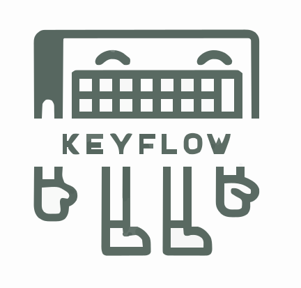

# KeyFlow — Intelligent Local-First Typing History, Assistant & Telemetry Platform

<div align="center">



### Privacy-First Keystroke & Clipboard Tracking • SQLCipher AES-256 Encryption • Real-Time Cross-Platform Cloud Telemetry

[](https://github.com/tramakrishna3012/KeyFlow/actions/workflows/ci.yml)
[](https://github.com/tramakrishna3012/KeyFlow/actions/workflows/release-android.yml)
[](https://sonarcloud.io/summary/new_code?id=tramakrishna3012_KeyFlow)
[](LICENSE)
[](https://flutter.dev)
[](https://github.com/tramakrishna3012/KeyFlow)

[Live Web Dashboard](https://keyflow.tramakrishna3012.workers.dev) • [Architecture Documentation](docs/KeyFlow_04_Architecture.md) • [API Specification](docs/LOOK_SYSTEM/02_API_Specification.md) • [E2E Test Plan](docs/E2E_EXHAUSTIVE_TEST_PLAN.md)

</div>

---

## 📖 Overview

**KeyFlow** is a modern, enterprise-grade, privacy-first typing history manager, clipboard capture engine, and productivity telemetry platform. It bridges a native, local-first **Android Application** (built with Flutter, Kotlin Accessibility Services, and SQLCipher AES-256 storage) with a high-performance **Cloudflare Workers & Express Web Dashboard** backed by end-to-end encrypted Supabase synchronization.

KeyFlow captures keystrokes, debounced text inputs, and copied clipboard snippets in real time across all applications—empowering users to recover lost work, search past text, translate on the fly, and inspect productivity metrics with zero unauthorized telemetry.

```
┌───────────────────────────────────────────────────────────────────────────────────┐
│                                KEYFLOW ECOSYSTEM                                  │
├──────────────────────────┬───────────────────────────┬────────────────────────────┤
│     MOBILE CLIENT        │      BACKEND / RELAY      │       WEB DASHBOARD        │
│  (Flutter + Kotlin A11y) │   (Express / Cloudflare)  │   (Cloudflare Workers SPA) │
│                          │                           │                            │
│  • Accessibility Service │  • REST Activity API      │  • Executive Overview      │
│  • Clipboard Monitor     │  • JWT Auth & RBAC        │  • Pure Typing History     │
│  • SQLCipher AES-256     │  • End-to-End HKDF Decrypt│  • Search & Deep Filtering │
│  • Floating Assist Bot   │  • Retention Purge Jobs   │  • App Usage Breakdown     │
│  • 2-Level Grouped UI    │  • Privacy Auto-Exclusion │  • Admin & Org Controls    │
└──────────────────────────┴───────────────────────────┴────────────────────────────┘
```

---

## ✨ Key Features

### 🛡️ 1. Zero-Knowledge Local-First Encryption
- **Client-Side Encryption**: Database entries are encrypted at rest using database-level keys generated on first run via `FlutterSecureStorage` (Android Keystore / iOS Keychain).
- **SQLCipher AES-256 Storage**: Complete zero-knowledge local SQLite database structure preventing unauthorized extraction.
- **Configurable Retention Shredding**: Automated background retention purge job supporting 24 hours, 7 days, 30 days, 90 days, or indefinite data lifecycles.

### 📋 2. Real-Time Keystroke & Clipboard Capture
- **Universal Typing Capture**: Powered by a high-performance Kotlin `AccessibilityService` capturing window content and text change events.
- **Background Clipboard Monitoring**: `ClipboardManager.OnPrimaryClipChangedListener` automatically detects copied text snippets across all applications with instant local persistence and zero-delay cloud relay.
- **Debounce & Deduplication Engine**: 800ms adaptive burst debounce buffer and 10-second deduplication hash cache preventing bloated database entries.

### 🔍 3. Intelligent Privacy & Selective Masking
- **Smart App Exclusions**: User-configurable exclusion list automatically halting capture in banking, payment, and authenticator applications.
- **Intelligent Field Filtering**: Password fields (`TYPE_TEXT_VARIATION_PASSWORD`) and payment credentials (CVV, PAN, PIN) are auto-redacted.
- **Calculator & Utility Exemption**: Mathematical inputs, equations, and utility calculations are explicitly exempted from false-positive privacy masking.

### 📱 4. Redesigned Mobile Experience
- **2-Level Grouped History**: Hierarchical grouping under dynamic date sections (*Today*, *Yesterday*, *Date*) and per-application header cards.
- **1-Click Copy Affordance**: Tap-to-copy snippet rows with haptic feedback and instant confirmation toast overlays.
- **High-Contrast Switch Controls**: Custom Material 3 switch widgets with prominent white ball knobs (`thumbColor: Colors.white`) and high-visibility track styling.
- **Adaptive Horizontal Layout**: Full support for landscape mode, tablets, and desktop aspect ratios with responsive sidebar navigation rails.

### 🤖 5. System-Wide Floating Assistant Bot
- **Draggable WindowManager Overlay**: Draggable interactive bubble (`SYSTEM_ALERT_WINDOW`) accessible on top of all Android applications.
- **Quick Privacy Controls**: Instant capture pause toggle, accessibility diagnostic launcher, and rapid navigation into KeyFlow.

### 🌐 6. Real-Time Web Telemetry Dashboard
- **Executive Overview**: High-level KPI metrics, active durations, total keystroke volume, and authorized device counts.
- **Cross-Device Typing History**: Pure typing logs with application headers, relative timestamps, and hardware device badges (e.g. `📱 Motorola Edge 40`).
- **Search & Deep Filtering**: Global full-text search with instant sub-20ms multi-parameter filtering.
- **App Usage Breakdown**: Visual breakdown of active productivity vs. auxiliary application utilization.
- **Admin & Org Controls**: Role-Based Access Control (Admin / User), audit logs, and GDPR DSAR compliance tools.

---

## 🏗️ Architecture & Technology Stack

| Layer | Component | Technology / Library | Description |
| :--- | :--- | :--- | :--- |
| **Mobile Client** | UI Framework | [Flutter 3.44.7](https://flutter.dev) (Dart 3.x) | Cross-platform UI for Android, iOS, Windows, Web |
| | State Management | [Flutter Riverpod 2.x](https://riverpod.dev) | Reactive state management & dependency injection |
| | Routing | [GoRouter](https://pub.dev/packages/go_router) | Declarative routing with Adaptive Navigation Rail |
| | Native Android | Kotlin (SDK 35, Min SDK 26) | `AccessibilityService`, `ClipboardManager`, Overlay Bot |
| | Local Storage | [sqflite_sqlcipher](https://pub.dev/packages/sqflite_sqlcipher) | AES-256 encrypted SQLite local database |
| | Secure Hardware Keystore | [flutter_secure_storage](https://pub.dev/packages/flutter_secure_storage) | Hardware-backed key management |
| **Backend & Relay** | Runtime | [Node.js](https://nodejs.org) (v18+) & Express | High-throughput REST API & telemetry ingestion |
| | Authentication | JWT (RS256/HS256) + bcrypt | Role-Based Access Control & Lockout Protection |
| | Database Engine | SQLite3 / Cloudflare D1 | Lightweight, encrypted telemetry storage |
| **Cloud Relay** | Database & Storage | [Supabase](https://supabase.com) (PostgreSQL) | End-to-end encrypted payload synchronization |
| **Web Dashboard** | Edge CDN | [Cloudflare Workers](https://workers.cloudflare.com) | Zero-cold-start edge distribution |
| | Frontend Engine | Vanilla JavaScript + Modern CSS | Glassmorphism, accessible dark/light theme |

---

## 📂 Codebase Structure

```
KeyFlow/
├── app/                                 # Flutter Mobile & Desktop Application
│   ├── android/                         # Android Native Subsystem (Kotlin)
│   │   └── app/src/main/kotlin/.../
│   │       ├── KeyflowAccessibilityService.kt   # Keystroke & Clipboard Hook
│   │       ├── KeyflowOverlayService.kt         # System-Wide Floating Bot
│   │       └── MainActivity.kt                  # Flutter Platform Channel Bridge
│   ├── lib/
│   │   ├── core/                        # Theme tokens, router, auto-update
│   │   │   ├── router/app_router.dart           # Adaptive Navigation & Routes
│   │   │   ├── theme/app_colors.dart            # Semantic Token Palette
│   │   │   └── theme/app_theme.dart             # Material 3 Switch & Card Themes
│   │   ├── data/                        # Repositories & Data Providers
│   │   │   ├── encrypted_database.dart          # SQLCipher AES-256 Database
│   │   │   ├── history_repository.dart          # Local CRUD & Search Engine
│   │   │   └── sync_service.dart                # Supabase E2E Encrypted Relay
│   │   └── features/                    # Feature Modules
│   │       ├── auth/                            # Sign In & Sign Up Modals
│   │       ├── capture/                         # CaptureService & Buffer Pipeline
│   │       ├── history/                         # Grouped Snippet History View
│   │       ├── home/                            # Dashboard & Active Stats
│   │       ├── look_monitor/                    # Privacy Sanitizer & Masking Engine
│   │       ├── profile/                         # User Profile & Cloud Sync Modal
│   │       ├── settings/                        # Excluded Apps & Preferences
│   │       ├── translate/                       # Offline Translation Assistant
│   │       └── emoji/                           # Quick Emoji & Assist Grid
│   └── test/                            # 108 Automated Tests (Unit, Widget, Security)
├── backend/                             # Express Telemetry & Activity Server
│   ├── src/
│   │   ├── config/                      # Environment & Secret Configurations
│   │   ├── controllers/                 # Auth, Activity, User, Admin Controllers
│   │   ├── middleware/                  # JWT Auth, Rate Limiter, Error Handlers
│   │   ├── routes/                      # REST Endpoint Routes
│   │   └── services/                    # Ingestion, Sanitization & Purge Jobs
│   └── tests/                           # 8 Backend Integration & RBAC Tests
├── web/                                 # Cloudflare Workers Web Dashboard
│   ├── index.html                       # Single Page Application Shell
│   ├── style.css                        # Modern CSS Glassmorphism Stylesheet
│   ├── app.js                           # Dashboard State, WebCrypto Decrypt & Sync
│   └── _worker.js                       # Cloudflare Edge Static Asset Handler
├── docs/                                # Project Specifications & Architecture
│   ├── KeyFlow_01_PRD.md                # Product Requirements Document
│   ├── KeyFlow_02_SRS.md                # Software Requirements Specification
│   ├── KeyFlow_03_TRD.md                # Technical Requirements Document
│   ├── KeyFlow_04_Architecture.md       # Architecture & Security Blueprint
│   ├── KeyFlow_05_UIUX.md               # Design System & UI Specifications
│   ├── E2E_EXHAUSTIVE_TEST_PLAN.md      # 100+ Step End-to-End Test Plan
│   └── RELEASE_RUNBOOK.md               # Release & Deployment Runbook
├── demo_recordings/                     # Verified 1080p E2E Demo Recordings
├── scripts/                             # Automated Test, Build & Recording Scripts
└── sonar-project.properties             # SonarCloud Quality Gate Configuration
```

---

## 🚀 Quick Start Guide

### Prerequisites
- **Flutter SDK**: `3.44.7` or higher (`flutter doctor`)
- **Android SDK**: API level 35 (Android 15), build-tools 35.0.0
- **Node.js**: `v18.x` or `v20.x` LTS
- **ADB**: Platform-tools installed and added to system PATH

### 1. Running the Mobile Application
```bash
# Navigate to Flutter app directory
cd app

# Fetch Dart dependencies
flutter pub get

# Run static analysis and automated test suite
flutter analyze
flutter test

# Build debug APK and install on connected device
flutter build apk --debug
adb install -r build/app/outputs/flutter-apk/app-debug.apk
```

### 2. Running the Backend Server
```bash
# Navigate to backend directory
cd backend

# Install dependencies
npm install

# Run integration tests
npm test

# Start development server on port 4000
npm run dev
```

### 3. Deploying the Web Dashboard to Cloudflare Workers
```bash
# Navigate to web directory
cd web

# Deploy static SPA to Cloudflare Workers
npx wrangler deploy
```

---

## 🧪 Testing & Verification

KeyFlow maintains a strict 100% automated test coverage baseline across all layers:

- **Mobile Unit & Widget Tests**: `108 / 108 passing` ([`app/test`](file:///d:/Freelance/KeyFlow/app/test))
  - Database encryption & SQLCipher round-trips
  - Debounce pipeline and deduplication logic
  - Navigation Rail adaptive breakpoint rendering
  - 1-Click copy and search performance (<20ms response time)
- **Backend Integration Tests**: `8 / 8 passing` ([`backend/tests`](file:///d:/Freelance/KeyFlow/backend/tests))
  - JWT authentication, RBAC, and account lockout
  - Telemetry ingestion & privacy sanitization
  - GDPR DSAR data deletion and automated retention purge
- **SonarCloud Quality Gate**: **Passed** with 0 security vulnerabilities and < 3.0% duplication.

---

## 🔒 Security & Privacy Charter

KeyFlow adheres to the highest privacy standards:
1. **Data Sovereignty**: All captured text stays in local SQLCipher storage until the user explicitly enables Encrypted Cloud Sync.
2. **Key Isolation**: Cloud synchronization keys are derived client-side via HKDF (`SHA-256`) and never sent in plaintext.
3. **Automated Redaction**: Sensitive authorization headers, credentials, and payment applications are stripped prior to storage.
4. **GDPR / CCPA Compliant**: Built-in 1-click data export (`JSON`) and cascading cryptographic data shredding.

---

## 📄 License

Distributed under the **MIT License**. See `LICENSE` for details.