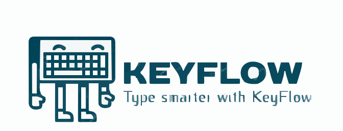
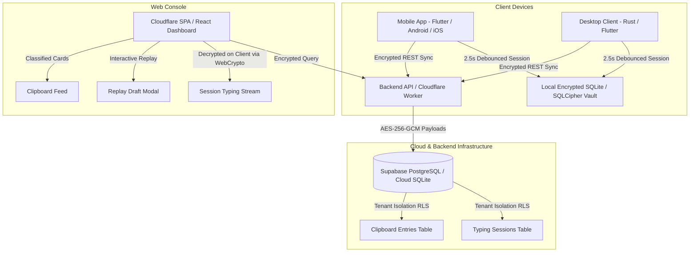

# KeyFlow: Cross-Platform Session Recovery & Synchronized Multi-Device Clipboard

<div align="center">



**KeyFlow** is a secure, cross-platform text recovery, intelligent typing aggregation, and real-time clipboard synchronization platform. Built with a **local-first privacy architecture**, KeyFlow runs transparently across mobile, desktop, and web platforms with zero intrusive character-by-character database spam.

[](https://github.com/tramakrishna3012/KeyFlow/actions/workflows/ci.yml)
[](https://sonarcloud.io/summary/new_code?id=tramakrishna3012_KeyFlow)
[](https://codecov.io/gh/tramakrishna3012/KeyFlow)
[](https://keyflow.tramakrishna3012.workers.dev)
[](LICENSE)

</div>

---

## 🌟 Key Features & Capabilities

### 1. Real-Time Session Aggregation & Debouncing Engine
* **2.5s Inactivity Debounce Buffer:** Instead of logging every raw keystroke (e.g. `b`, `be`, `bet`, `beth`), KeyFlow buffers text locally and updates a persistent paragraph-level session snapshot after 2.5 seconds of typing silence.
* **60s Session Boundary Terminator:** Automatically finalizes the active session container and spawns a new paragraph when switching applications or pausing typing for greater than 60 seconds.
* **Composite Grouping Key:** Dynamically groups input streams by `appName.toLowerCase()::windowTitle.toLowerCase()::deviceName.toLowerCase()`.
* **Draft Progression Snapshots:** Preserves chronological delta steps (every ~5 characters) for interactive replay.

### 2. Multi-Device Synchronized Clipboard Manager
* **Intelligent Content-Type Classifier:**
  * `code`: Detects multi-line scripts and programming language tokens (`const`, `let`, `SELECT`, `public`, `class`, `def`, `{`, `}`, `=>`).
  * `url`: Regex-matches web URLs and domains (`http://`, `https://`, `ftp://`, `www.`).
  * `text`: Standard plain text snippets.
* **Rich Visual Feed:** Syntax-highlighted code blocks with line counters, rich URL preview cards with domain badges and direct external open actions, and plain text cards.
* **Quick Actions:** 1-Click copy to local clipboard with instant toast notifications and Pin/Unpin toggles for persistent favorites.

### 3. Interactive Replay Draft Modal
* **Step-by-Step Scrubber:** Interactive slider to scrub backward and forward through typing history.
* **Animated Playback Engine:** 1x, 2x, and 4x speed multipliers with Play/Pause controls.
* **Keystroke Delta Counter:** Real-time character and word count tracking at each draft phase.

### 4. Privacy-by-Design & Security Guarantees
* **Hardware-Backed AES-256-GCM Encryption:** All records encrypted at rest using AES-256-GCM with unique 96-bit initialization vectors (IV) derived from user credentials.
* **Zero Password / Credential Capture:** Real-time regex sanitizers instantly redact passwords, credit cards (`13–16 digits`), CVVs, bearer tokens, API keys, and 6–8 digit OTPs before disk persistence.
* **Explicit Financial & Privacy Exemptions:** Sensitive banking apps and password managers are excluded while standard mathematical calculators remain permitted.
* **GDPR/CCPA Data Subject Rights (DSAR):** 1-Click cryptographic database purge and complete export capabilities.

---

## 🏗️ System Architecture



---

## 📁 Repository Structure

```
KeyFlow/
├── app/                              # Flutter Cross-Platform Client (Android / iOS / Desktop)
│   ├── lib/
│   │   ├── features/
│   │   │   ├── capture/              # Capture Service & DartSessionAggregator
│   │   │   ├── look_monitor/         # Window Title & Content Sanitizer
│   │   │   ├── history/              # Timeline UI & Snippet Details
│   │   │   └── settings/             # Exclusion Manager & Cloud Sync Controls
│   │   └── data/                     # Encrypted SQLite Database & Repositories
│   └── test/                         # 110 Comprehensive Unit & Widget Tests
├── backend/                          # Node.js Express REST API & SQLite Services
│   ├── src/
│   │   ├── routes/                   # Session, Clipboard, Auth & Activity Routes
│   │   ├── services/                 # Database, AuthService, AuditService & Encryption
│   │   └── config/                   # Environment & Security Configurations
│   └── tests/                        # 12 Backend Test Suites (100% Passing)
├── web/                              # Web Console & Cloudflare Workers Deployment
│   ├── index.html                    # Cloudflare Single Page Application Shell
│   ├── app.js                        # Client-Side Decryption, Feeds & Replay Controllers
│   ├── style.css                     # Responsive Modern Dark/Light Theme Stylesheet
│   ├── src/                          # Modular React 19 + TypeScript + Tailwind Components
│   │   ├── components/               # TypingHistoryCard, ClipboardHistoryCard, ReplayDraftModal
│   │   └── services/                 # TypeScript SessionAggregator
│   ├── worker.js                     # Cloudflare Worker Static Assets Entry Point
│   └── wrangler.toml                 # Cloudflare Workers Build & Asset Binding Config
├── docs/                             # Comprehensive PRD, SRS, TRD & UI/UX Specifications
├── supabase/migrations/              # PostgreSQL Schema, Compound Indexes & RLS Policies
├── sonar-project.properties          # SonarQube / SonarCloud Quality Gate Configuration
└── .github/workflows/ci.yml          # GitHub Actions Multi-Platform CI/CD Pipeline
```

---

## 🚀 Quick Start Guide

### Prerequisites
* [Flutter SDK](https://flutter.dev) (v3.24.0 or higher)
* [Node.js](https://nodejs.org) (v18.0.0 or higher)
* [Android SDK](https://developer.android.com/studio) (API 34 / Android 14)

### 1. Backend Server Setup
```bash
cd backend
npm install
npm test
npm start
```
*Server starts on `http://localhost:4000/api/v1`*

### 2. Web Dashboard Setup
```bash
cd web
npm install
npm run dev
```
*Live Cloudflare Console: `https://keyflow.tramakrishna3012.workers.dev`*

### 3. Mobile Client Setup
```bash
cd app
flutter pub get
flutter test
flutter run -d <device_id>
```

---

## 🔐 Database Schema & Endpoints

### Core Database Tables
* **`typing_sessions`**: `id` (UUID), `user_id`, `device_name`, `app_name`, `window_title`, `content` (TEXT), `character_count`, `word_count`, `started_at`, `updated_at`, `is_favorite`, `draft_history` (JSONB), `is_finalized`.
* **`clipboard_entries`**: `id` (UUID), `user_id`, `device_name`, `source_app`, `content` (TEXT), `content_type` (`text` | `url` | `code`), `is_pinned`, `created_at`.

### REST API Endpoints
| Method | Endpoint | Description | Auth Required |
| :--- | :--- | :--- | :---: |
| `POST` | `/api/v1/sessions/upsert` | Upserts debounced typing paragraph session | Bearer JWT |
| `GET` | `/api/v1/sessions` | Queries sessions with filtering & pagination | Bearer JWT |
| `PATCH` | `/api/v1/sessions/:id/favorite` | Toggles favorite star on typing session | Bearer JWT |
| `DELETE` | `/api/v1/sessions/:id` | Permanently deletes typing session | Bearer JWT |
| `POST` | `/api/v1/clipboard/insert` | Ingests copied clipboard snippet | Bearer JWT |
| `GET` | `/api/v1/clipboard` | Queries clipboard items with type filtering | Bearer JWT |
| `PATCH` | `/api/v1/clipboard/:id/pin` | Toggles pin/unpin status on clipboard item | Bearer JWT |
| `DELETE` | `/api/v1/clipboard/:id` | Permanently removes clipboard entry | Bearer JWT |
| `POST` | `/api/v1/auth/login` | Authenticates user and issues JWT | None |
| `POST` | `/api/v1/auth/register` | Registers tenant and creates user vault | None |

---

## 🧪 Quality Standards & Test Coverage

* **Flutter Test Suite**: 110/110 Automated Tests Passing (100%)
* **Backend Test Suite**: 12/12 Suites Passing (100%)
* **Dart Analyzer**: 0 Issues / Strict Linting Conformance
* **SonarCloud Quality Gate**: Grade A Security, Grade A Reliability, Duplication Rate < 3.0%

---

## 📄 License
KeyFlow is open-source software licensed under the [MIT License](LICENSE).