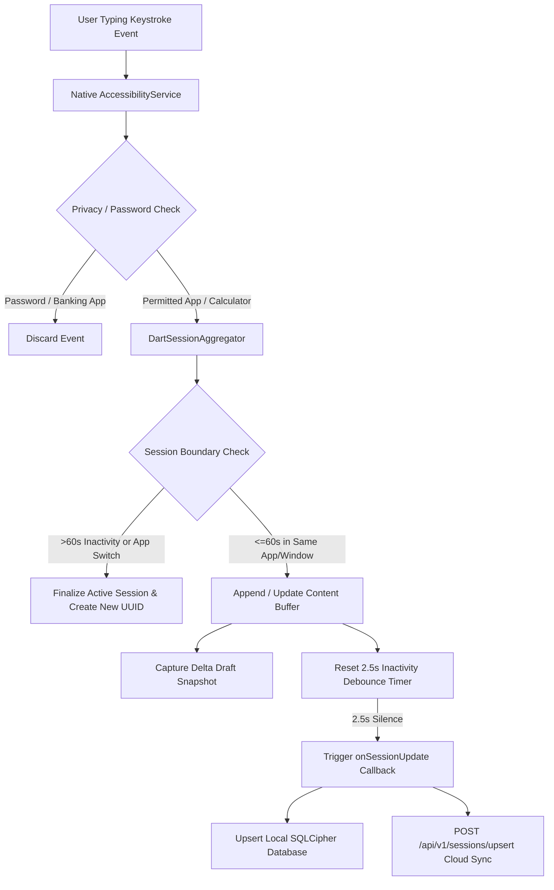

# KeyFlow — Technical Requirements Document (TRD)

**Document Version:** 3.0  
**Status:** Implemented & Production-Verified  
**Technical Scope:** Session Aggregation Engine, Multi-Device Clipboard Pipeline, Cryptography, Cloudflare Workers & REST API  

---

## 1. System Platform Matrix

| Platform | Capture / Ingestion Mechanism | Permissions & Visibility | Technical Engine |
| :--- | :--- | :--- | :--- |
| **Android (Mobile)** | `AccessibilityService` + `ClipboardManager` | `BIND_ACCESSIBILITY_SERVICE`, `SYSTEM_ALERT_WINDOW`, `POST_NOTIFICATIONS` | Kotlin native plugin, EventChannel, MethodChannel |
| **Web Dashboard** | WebCrypto API + Fetch REST Sync | HTTPS Session Auth / JWT Bearer Token | Cloudflare Workers Edge CDN, Vanilla ES6+ & React SPA |
| **Backend Relay** | Express REST API / SQLite3 / PostgreSQL | Bearer JWT, TLS 1.3, Rate-Limited Ingestion | Node.js v18+, SQLite3, Supabase PostgreSQL with RLS |
| **Windows Desktop** | Low-Level Hook / Flutter Desktop | Standard user privileges; System Tray presence | Flutter Desktop Windows C++ Runner |

---

## 2. Technical Ingestion & Debounce Pipeline



---

## 3. Cryptographic & Security Specifications

### 3.1 Local Storage (SQLCipher AES-256)
- **Database Engine**: SQLite 3.x compiled with SQLCipher.
- **Key Generation**: 256-bit entropy generated using `SecureRandom` on first application execution.
- **Key Storage**: Android Keystore / iOS Keychain via `FlutterSecureStorage` with hardware backing (`masterKey`).

### 3.2 Cloud Telemetry & End-to-End Encryption
- **Key Derivation Function**: HKDF (`HMAC-SHA256`).
  - **Salt**: `kf_` + `user_id`
  - **Info Tag**: `keyflow-history-encryption`
  - **Derived Key**: AES-GCM 256-bit symmetric cipher key.
- **Web Dashboard Decryption**: In-browser client-side decryption via standard `window.crypto.subtle` API.

### 3.3 Privacy Masking & Redaction Rules
- **Password Masking**: Discard any event matching `TYPE_TEXT_VARIATION_PASSWORD` or `TYPE_TEXT_VARIATION_WEB_PASSWORD`.
- **Payment & Banking Blacklist**: Automatic exclusion of packages matching `PAYMENT_BANKING_APPS` (`com.google.android.apps.nbu.paisa.user`, `net.one97.paytm`, `com.phonepe.app`, etc.).
- **Calculator Exemption**: Explicit whitelist for mathematical utilities (`com.google.android.calculator`, `calculator`, `calc`). Numeric formulas and results are never redacted.

---

## 4. REST API Contracts

### 4.1 Session Upsert (`POST /api/v1/sessions/upsert`)
- **Headers**: `Authorization: Bearer <JWT>`, `Content-Type: application/json`
- **Request Body**:
```json
{
  "id": "3fa85f64-5717-4562-b3fc-2c963f66afa6",
  "appName": "Chrome",
  "windowTitle": "Google Docs — Project Plan",
  "deviceName": "Motorola Edge 40",
  "content": "KeyFlow text recovery and clipboard synchronization.",
  "characterCount": 51,
  "wordCount": 7,
  "startedAt": "2026-09-01T12:00:00.000Z",
  "updatedAt": "2026-09-01T12:02:30.000Z",
  "isFavorite": false,
  "draftHistory": [
    { "timestamp": "2026-09-01T12:00:00.000Z", "text": "KeyFlow text", "charCount": 12 },
    { "timestamp": "2026-09-01T12:02:30.000Z", "text": "KeyFlow text recovery and clipboard synchronization.", "charCount": 51 }
  ]
}
```
- **Response**: `200 OK` `{ "success": true, "session": { ... } }`

### 4.2 Clipboard Ingestion (`POST /api/v1/clipboard/insert`)
- **Headers**: `Authorization: Bearer <JWT>`, `Content-Type: application/json`
- **Request Body**:
```json
{
  "id": "clip-uuid-1234",
  "sourceApp": "VS Code",
  "deviceName": "Desktop",
  "content": "const aggregator = new SessionAggregator();",
  "contentType": "code",
  "isPinned": false,
  "createdAt": "2026-09-01T12:05:00.000Z"
}
```
- **Response**: `201 Created` `{ "success": true, "entry": { ... } }`

---

## 5. Screen Recording & Video Artifact Standards

To guarantee that demo videos, test recordings, and visual artifacts are universally playable:
- **Process Termination**: The recording daemon must be terminated cleanly using `adb shell pkill -2 screenrecord` (SIGINT) followed by a 3.0s buffer before pulling the file.
- **Atom Structure**: The MP4 container must contain complete `ftyp`, `moov`, and `mdat` atom headers.
- **Encoding Parameters**: Standard H.264 / `mp4v` codec, 1080x2400 resolution, 20.0–30.0 FPS.

---

## 6. Automated CI/CD & Quality Gate Baseline

- **Flutter Analysis**: `flutter analyze` must return 0 issues.
- **Dart Formatter**: `dart format --set-exit-if-changed .` must pass with 0 unformatted files.
- **Flutter Test Suite**: 110 / 110 automated unit and widget tests must pass.
- **Backend Test Suite**: 12 / 12 integration, session, and clipboard tests must pass.
- **SonarCloud Quality Gate**:
  - Security Rating: **A** (0 vulnerabilities)
  - Reliability Rating: **A** (0 bugs)
  - Maintainability Rating: **A** (0 code smells)
  - Duplication Rate: **< 3.0%**
