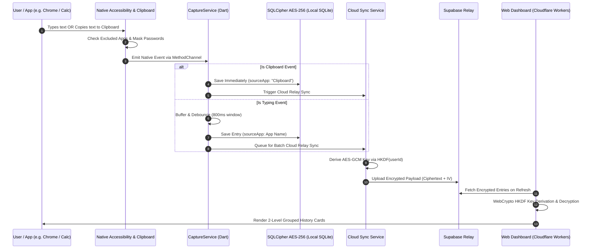

# KeyFlow — Full System Architecture & Security Blueprint

**Document Version:** 2.0  
**Status:** Implemented & Verified  
**Scope:** Mobile Client (Flutter/Kotlin), Express Telemetry Server, Cloudflare Workers Dashboard, Supabase Relay  

---

## 1. Architectural Overview

KeyFlow is designed around a **Local-First, Zero-Knowledge Privacy Architecture** with optional, end-to-end encrypted cloud telemetry synchronization.

```
┌──────────────────────────────────────────────────────────────────────────────────────────────────┐
│                                    KEYFLOW ARCHITECTURE TOPOLOGY                                 │
├──────────────────────────────────────┬───────────────────────────────────────────────────────────┤
│          MOBILE CLIENT ENGINE        │                   CLOUD & WEB SUBSYSTEM                   │
│                                      │                                                           │
│  ┌────────────────────────────────┐  │  ┌──────────────────────────┐  ┌────────────────────────┐ │
│  │    Android Native Subsystem    │  │  │  Express Telemetry API   │  │   Cloudflare Workers   │ │
│  │ ────────────────────────────── │  │  │  (Node.js / SQLite3)     │  │   Edge Dashboard (SPA) │ │
│  │ • AccessibilityService (Kotlin)│  │  │                          │  │                        │ │
│  │ • ClipboardManager Listener    │──┼──┼─►• Ingestion & Debounce  │  │ • Executive Overview   │ │
│  │ • WindowManager Overlay Bot    │  │  │  • JWT Auth & RBAC       │  │ • Cross-Device History │ │
│  │ • Broadcast Channels           │  │  │  • Privacy Auto-Masking  │  │ • WebCrypto HKDF Decr  │ │
│  └───────────────┬────────────────┘  │  │  • Retention Purge Jobs  │  │ • Search & Filtering   │ │
│                  │ MethodChannel     │  └─────────────┬────────────┘  └───────────▲────────────┘ │
│  ┌───────────────▼────────────────┐  │                │                           │              │
│  │     Flutter Application        │  │                │ REST / Activity           │ HTTPS Static │
│  │ ────────────────────────────── │  │                ▼                           │ & Web APIs   │
│  │ • Riverpod State Management    │  │  ┌─────────────────────────────────────────┴────────────┐ │
│  │ • Adaptive GoRouter (Rail/Bar) │  │  │            Supabase Cloud Relay (PostgreSQL)         │ │
│  │ • 2-Level Grouped History UI   │  │  │ ─────────────────────────────────────────────────── │ │
│  │ • 1-Click Copy & Search Engine │──┼──┼─► • E2E Encrypted History Payload Table              │ │
│  │ • Material 3 Custom Switches   │  │  │ • Client-Side HKDF Derived AES-GCM Storage           │ │
│  └───────────────┬────────────────┘  │  └──────────────────────────────────────────────────────┘ │
│                  │                   │                                                           │
│  ┌───────────────▼────────────────┐  │                                                           │
│  │   Encrypted Local Storage      │  │                                                           │
│  │ ────────────────────────────── │  │                                                           │
│  │ • SQLCipher AES-256 (SQLite)   │  │                                                           │
│  │ • FlutterSecureStorage (Key)   │  │                                                           │
│  │ • Retention Auto-Purge Runner  │  │                                                           │
│  └────────────────────────────────┘  │                                                           │
└──────────────────────────────────────┴───────────────────────────────────────────────────────────┘
```

---

## 2. Component Breakdown

### 2.1 Native Android Capture Subsystem (`app/android`)
1. **`KeyflowAccessibilityService.kt`**:
   - Registered as an Android accessibility service listening for `TYPE_VIEW_TEXT_CHANGED`, `TYPE_VIEW_FOCUSED`, and `TYPE_WINDOW_CONTENT_CHANGED`.
   - **Clipboard Monitoring**: Hooks `ClipboardManager.OnPrimaryClipChangedListener` to capture text copied to clipboard instantly without debounce delay.
   - **Exclusion Engine**: Filters blacklisted applications at the native layer before text reaches Dart code.
   - **Discreet Foreground Execution**: Runs under the neutral notification title *"System Sync Service"* with minimal status text (*"Active"* / *"Paused"*).
2. **`KeyflowOverlayService.kt`**:
   - Implements a draggable floating assistant bot overlay via `WindowManager.LayoutParams.TYPE_APPLICATION_OVERLAY`.
   - Provides quick privacy controls (instant capture pause/resume) and accessibility settings diagnostics.

### 2.2 Flutter Core Layer (`app/lib`)
1. **`CaptureService` & Debounce Engine**:
   - Ingests events from native platform channels into an in-memory buffer.
   - Applies an **800ms adaptive burst debounce timer** for typing events and a **10-second deduplication cache**.
   - Direct path for clipboard events: persists immediately to local database and triggers background cloud sync.
2. **`LookWindowSanitizer` (Privacy Guard)**:
   - Inspects active application package and text contents.
   - Exempts Calculator and mathematical tools from numeric masking.
   - Automatically redacts password fields, authorization headers, and payment applications.
3. **`EncryptedDatabase` (SQLCipher AES-256)**:
   - Stores history records encrypted with AES-256.
   - Encryption key is stored in hardware Keystore via `flutter_secure_storage`.
4. **Adaptive Navigation & Theme System**:
   - `AppRouter`: Adapts from bottom navigation bar to `NavigationRail` sidebar on landscape and wide viewports.
   - `AppTheme`: Enforces Material 3 switch styling with prominent **white ball thumb knobs** (`Colors.white`).

### 2.3 Cloud Relay & Web Dashboard (`backend` & `web`)
1. **Express Telemetry Server (`backend/src`)**:
   - Ingests activity batches, verifies JWT auth, enforces RBAC, applies privacy masking, and schedules retention purge jobs.
2. **Supabase Relay Subsystem**:
   - Synchronizes encrypted payloads (`encrypted_text`, `iv`, `auth_tag`) derived client-side via HKDF (`SHA-256`).
3. **Cloudflare Workers Web Dashboard (`web/`)**:
   - Static Single Page Application (SPA) deployed at the edge with zero cold starts.
   - Features 6 responsive tabs: Executive Overview, Cross-Device Typing History, Search & Filtering, App Usage Breakdown, Admin & Org Controls, and Privacy & Exclusions.
   - Utilizes standard browser WebCrypto API to decrypt payloads in the client browser.

---

## 3. Data Flow & Security Sequence



---

## 4. Cryptographic Key Management & Storage

| Layer | Encryption Algorithm | Key Generation & Derivation | Storage Mechanism |
| :--- | :--- | :--- | :--- |
| **Local SQLite** | SQLCipher AES-256-CBC | Cryptographically secure 32-byte random key | Android Hardware Keystore / iOS Keychain via `FlutterSecureStorage` |
| **Cloud Relay** | AES-256-GCM | HKDF (`SHA-256`) with user ID salt and context tag | Key derived client-side on device and browser; never stored on server |
| **Backend REST** | AES-256-GCM / bcrypt | HMAC-SHA256 JWT secrets; salted bcrypt for passwords | Environment variables (`JWT_SECRET`) & hashed DB fields |
| **Edge Delivery** | TLS 1.3 | Automated Cloudflare Edge Certificates | Edge CDN SSL/TLS Termination |
