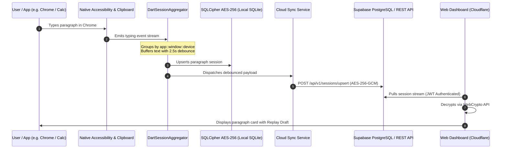

# KeyFlow — Full System Architecture & Security Blueprint

**Document Version:** 3.0  
**Status:** Implemented & Verified  
**Scope:** Mobile Client (Flutter/Kotlin), Express Telemetry Server, Cloudflare Workers Dashboard, Supabase PostgreSQL Relay  

---

## 1. Architectural Overview

KeyFlow is built upon a **Local-First, Zero-Knowledge Privacy Architecture** with real-time session debouncing and multi-device clipboard synchronization.

```
┌──────────────────────────────────────────────────────────────────────────────────────────────────┐
│                                    KEYFLOW ARCHITECTURE TOPOLOGY                                 │
├──────────────────────────────────────┬───────────────────────────────────────────────────────────┤
│          MOBILE CLIENT ENGINE        │                   CLOUD & WEB SUBSYSTEM                   │
│                                      │                                                           │
│  ┌────────────────────────────────┐  │  ┌──────────────────────────┐  ┌────────────────────────┐ │
│  │    Android Native Subsystem    │  │  │  Express Telemetry API   │  │   Cloudflare Workers   │ │
│  │ ────────────────────────────── │  │  │  (Node.js / SQLite3)     │  │   Edge Dashboard (SPA) │ │
│  │ • AccessibilityService (Kotlin)│  │  │                          │  │                        │ │
│  │ • ClipboardManager Listener    │──┼──┼─►• Ingestion & Debounce  │  │ • Executive Overview   │ │
│  │ • WindowManager Overlay Bot    │  │  │  • JWT Auth & RBAC       │  │ • Typing Stream Feed   │ │
│  │ • Broadcast Channels           │  │  │  • Session Upsert Engine │  │ • Clipboard Feed (Sync)│ │
│  └───────────────┬────────────────┘  │  │  • Retention Purge Jobs  │  │ • Replay Draft Modal   │ │
│                  │ MethodChannel     │  └─────────────┬────────────┘  └───────────▲────────────┘ │
│  ┌───────────────▼────────────────┐  │                │                           │              │
│  │     Flutter Application        │  │                │ REST / Activity           │ HTTPS Static │
│  │ ────────────────────────────── │  │                ▼                           │ & Web APIs   │
│  │ • DartSessionAggregator (2.5s) │  │  ┌─────────────────────────────────────────┴────────────┐ │
│  │ • Riverpod State Management    │  │  │            Supabase Cloud Relay (PostgreSQL)         │ │
│  │ • Adaptive GoRouter (Rail/Bar) │  │  │ ─────────────────────────────────────────────────── │ │
│  │ • 1-Click Copy & Search Engine │──┼──┼─► • Typing Sessions Table (RLS Tenant Isolated)      │ │
│  │ • Material 3 Custom Switches   │  │  │ • Clipboard Entries Table (Auto-Classified)          │ │
│  └───────────────┬────────────────┘  │  └──────────────────────────────────────────────────────┘ │
│                  │                   │                                                           │
│  ┌───────────────▼────────────────┐  │                                                           │
│  │   Encrypted Local Storage      │  │                                                           │
│  │ ────────────────────────────── │  │                                                           │
│  │ • SQLCipher AES-256 (SQLite)   │  │                                                           │
│  │ • FlutterSecureStorage (Key)   │  │                                                           │
│  │ • Retention Auto-Purge Runner  │  │                                                           │
│  └────────────────────────────────┘  │                                                           │
└──────────────────────────────────────┴───────────────────────────────────────────────────────────┘
```

---

## 2. Component Breakdown

### 2.1 Native Android Capture Subsystem (`app/android`)
1. **`KeyflowAccessibilityService.kt`**:
   - Registered as an Android accessibility service listening for text and focus change events.
   - **Clipboard Monitoring**: Hooks `ClipboardManager.OnPrimaryClipChangedListener` to capture copied text immediately.
   - **Exclusion Engine**: Filters blacklisted applications at the native layer before text reaches Dart code.
   - **Discreet Foreground Execution**: Runs under the neutral notification title *"System Sync Service"* with minimal status text.
2. **`KeyflowOverlayService.kt`**:
   - Implements a draggable floating assistant bot overlay via `WindowManager.LayoutParams.TYPE_APPLICATION_OVERLAY`.
   - Provides quick privacy controls (instant capture pause/resume) and accessibility settings diagnostics.

### 2.2 Client-Side Session Aggregator (`DartSessionAggregator` / `SessionAggregator.ts`)
1. **2.5s Inactivity Debounce Buffer**: Buffers raw typing and flushes only after 2.5s of typing silence.
2. **60s Termination Boundary**: Spawns a new session container when switching applications or pausing >60s.
3. **Composite Grouping Key**: `appName.toLowerCase()::windowTitle.toLowerCase()::deviceName.toLowerCase()`.
4. **Draft Progression Snapshots**: Records chronological typing snapshots for draft replay.

### 2.3 Cloud Relay & Web Dashboard (`backend` & `web`)
1. **Express Telemetry & Session Server (`backend/src`)**:
   - Endpoints: `POST /api/v1/sessions/upsert`, `GET /api/v1/sessions`, `POST /api/v1/clipboard/insert`, `GET /api/v1/clipboard`.
   - SQLite tables: `typing_sessions` and `clipboard_entries`.
2. **Supabase PostgreSQL Relay**:
   - Tables: `typing_sessions` and `clipboard_entries` with Row Level Security (RLS) policies (`auth.uid() = user_id`).
   - Automated metrics trigger: `calculate_typing_session_metrics()` for character and word counts.
3. **Cloudflare Workers Web Dashboard (`web/`)**:
   - SPA served via Cloudflare Workers Static Assets (`wrangler.toml` and `worker.js`).
   - Client-side AES-256-GCM WebCrypto decryption.
   - Tabs: Executive Overview, Typing Stream, Clipboard History, Search & Filtering, App Breakdown, Admin Controls, and Privacy & Exclusions.

---

## 3. Data Flow & Security Sequence


